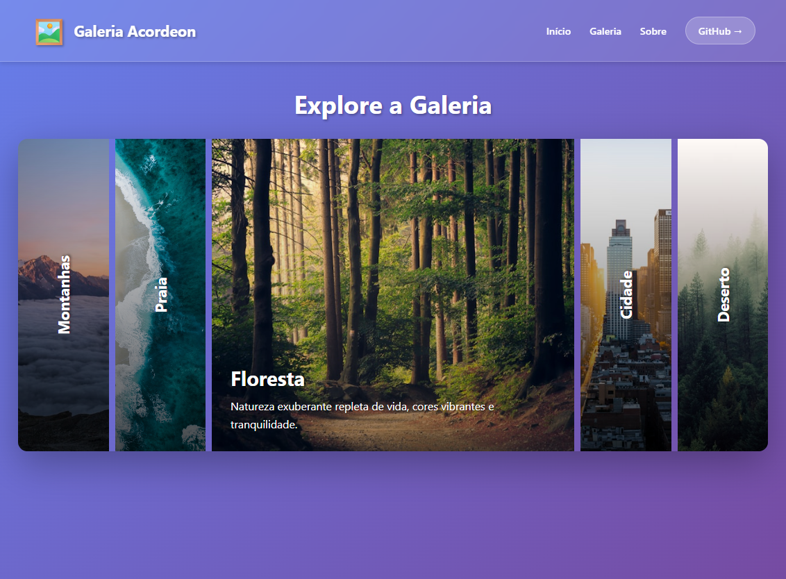

# Acordeon de Imagens - Galeria Interativa 

<div align="center">


**Galeria de imagens com efeito acordeon interativo**

Interface moderna com transições suaves e design responsivo

</div>

---

## Sobre o Projeto

**Acordeon de Imagens** é uma galeria interativa que apresenta imagens em formato de acordeon, com transições suaves e design moderno. Ao clicar em uma imagem, ela se expande revelando informações adicionais, enquanto as demais se comprimem.

### Características Principais

- Efeito acordeon suave e fluido
- Transições animadas com cubic-bezier
- Design responsivo (desktop e mobile)
- Gradientes sobrepostos para melhor legibilidade
- Labels rotacionadas em itens comprimidos
- Conteúdo revelado progressivamente
- Efeitos hover interativos
- Totalmente personalizável
- Sem dependências externas

---

## Tecnologias Utilizadas

- **HTML5** - Estrutura semântica da página
- **CSS3** - Estilização avançada com flexbox, transições e gradientes
- **JavaScript (Vanilla)** - Interatividade e manipulação do DOM
- **CSS Flexbox** - Layout responsivo e flexível
- **CSS Transitions** - Animações suaves entre estados
- **Unsplash API** - Imagens de alta qualidade

---

## Preview

<div align="center">



*Galeria acordeon com 5 categorias de imagens*

</div>

---

## Funcionalidades

### Efeito Acordeon
- Clique em qualquer item para expandi-lo
- Item ativo ocupa 4x mais espaço
- Transição suave de 0.6s com easing personalizado
- Apenas um item expandido por vez

### Sistema de Conteúdo
- **Labels Rotacionadas**: Texto vertical em itens comprimidos
- **Conteúdo Oculto**: Título e descrição aparecem ao expandir
- **Gradiente Overlay**: Melhora a legibilidade do texto
- **Efeitos Hover**: Feedback visual ao passar o mouse

### Categorias Incluídas
1. **Montanhas** - Paisagens majestosas
2. **Praia** - Ondas e areias douradas
3. **Floresta** - Natureza exuberante
4. **Cidade** - Arquitetura moderna
5. **Deserto** - Vastidão dourada

### Interações Visuais
- **Transição Suave**: Cubic-bezier para movimento natural
- **Fade In/Out**: Conteúdo aparece/desaparece gradualmente
- **Transform Scale**: Labels desaparecem ao expandir
- **Opacity Changes**: Gradientes se ajustam ao hover
- **Responsive Behavior**: Layout muda em dispositivos móveis

---

## Como Rodar o Projeto

### Opção 1: Servidor Local

1. **Clone o repositório**

```bash
git clone https://github.com/erikalaiane/acordeon-imagens.git
```

2. **Entre no diretório do projeto**

```bash
cd acordeon-imagens
```

3. **Abra com um servidor local**

Você pode usar:
- **Live Server** (extensão do VS Code)
- **Python**: `python -m http.server 8000`
- **Node.js**: `npx serve`

4. **Acesse no navegador**

Abra [http://localhost:8000](http://localhost:8000) (ou a porta indicada)

### Opção 2: Abrir Diretamente

Simplesmente abra o arquivo `index.html` no seu navegador preferido.

---

## Estrutura do Projeto

```
acordeon-imagens/
├── index.html           # Estrutura HTML
├── style.css            # Estilos e animações (inline)
├── script.js            # Lógica de interatividade (inline)
├── preview.png          # Imagem de preview
└── README.md            # Documentação
```

---

## Destaques do Código

### Transição Suave
```css
.accordion-item {
    transition: flex 0.6s cubic-bezier(0.4, 0, 0.2, 1);
}

.accordion-item.active {
    flex: 4;
}
```

### Gradiente Overlay
```css
.accordion-item::before {
    background: linear-gradient(
        to bottom, 
        transparent 0%, 
        rgba(0,0,0,0.7) 100%
    );
}
```

### Interatividade JavaScript
```javascript
items.forEach(item => {
    item.addEventListener('click', () => {
        items.forEach(i => i.classList.remove('active'));
        item.classList.add('active');
    });
});
```

---

## Responsividade

O projeto é totalmente responsivo e otimizado para:

- **Mobile**: 320px - 767px (layout vertical)
- **Tablet**: 768px - 1023px (layout horizontal adaptado)
- **Desktop**: 1024px+ (layout horizontal completo)

Em dispositivos móveis, o acordeon automaticamente muda para layout vertical, mantendo toda a funcionalidade.

---

## Paleta de Cores

```css
/* Gradiente de fundo */
background: linear-gradient(135deg, #667eea 0%, #764ba2 100%);

/* Overlay escuro */
rgba(0, 0, 0, 0.7) - Gradiente inferior

/* Texto */
color: white - Títulos e descrições

/* Sombras */
box-shadow: 0 20px 60px rgba(0,0,0,0.3)
text-shadow: 2px 2px 4px rgba(0,0,0,0.5)
```

---

## Personalização

### Trocar as Imagens

```html
<div class="accordion-item" 
     style="background-image: url('SUA-IMAGEM-AQUI')">
```

### Ajustar Velocidade

```css
.accordion-item {
    transition: flex 0.6s; /* Mude o tempo aqui */
}
```

### Mudar Proporção

```css
.accordion-item.active {
    flex: 4; /* Item ativo (4x maior) */
}

.accordion-item {
    flex: 1; /* Itens normais */
}
```

---

## Contribuindo

Contribuições são sempre bem-vindas! Para contribuir:

1. Faça um fork do projeto
2. Crie uma branch para sua feature (`git checkout -b feature/MinhaFeature`)
3. Commit suas mudanças (`git commit -m 'Adiciona nova feature'`)
4. Push para a branch (`git push origin feature/MinhaFeature`)
5. Abra um Pull Request

### Ideias para Contribuições
- Adicionar navegação por teclado (setas)
- Implementar modo carrossel automático
- Adicionar mais categorias de imagens
- Criar variações de layout (vertical, grid)
- Adicionar lightbox ao clicar
- Implementar lazy loading de imagens
- Adicionar filtros e categorias dinâmicas

---

## Melhorias Futuras

- [ ] Navegação por teclado
- [ ] Auto-play opcional
- [ ] Indicadores de navegação
- [ ] Lazy loading de imagens
- [ ] Lightbox modal
- [ ] Filtros por categoria
- [ ] Integração com APIs de imagens
- [ ] Modo carrossel
- [ ] Suporte a vídeos

---

## Inspiração

Este projeto foi inspirado em galerias de portfólio modernas e interfaces de streaming, combinando simplicidade com elegância visual. O efeito acordeon cria uma experiência imersiva que destaca uma imagem por vez sem perder o contexto das demais.

---

## Autora

**Erika Laiane**

[](https://github.com/erikalaiane)
[](https://www.linkedin.com/in/erika-laiane-azevedo)
[](mailto:erikalaianeazevedosantos@gmail.com)

---

<div align="center">

Desenvolvido com 💜 por Erika Laiane

</div>